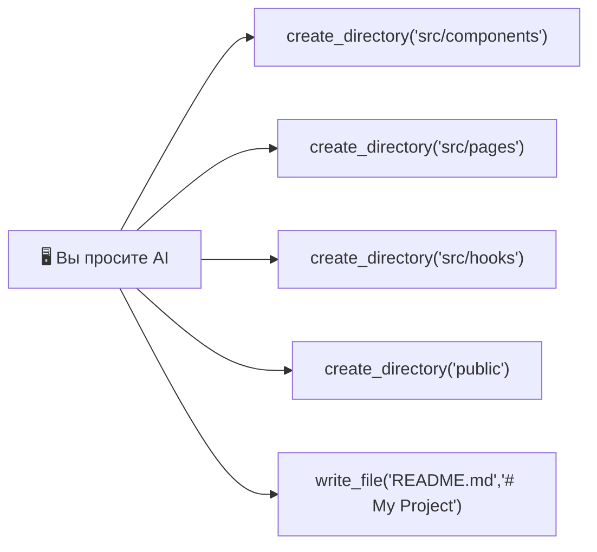

[🇬🇧 English version](README.md)

<br />

<div align="center">
  <h1>🖥️ @developkiko/desktop-commander</h1>
  <p><strong>MCP-сервер для управления терминалом и файлами</strong></p>
  <p>Форк <a href="https://github.com/wonderwhy-er/DesktopCommanderMCP">Desktop Commander</a> с критическими исправлениями для работы с большими файлами</p>

  <p>
    <a href="https://www.npmjs.com/package/@developkiko/desktop-commander">
      
    </a>
    <a href="https://github.com/developkiko/DsktpCmndr/blob/main/LICENSE">
      
    </a>
    <a href="https://github.com/developkiko/DsktpCmndr">
      
    </a>
    <br />
    <a href="https://nodejs.org/">
      
    </a>
    <a href="https://www.typescriptlang.org/">
      
    </a>
    
  </p>
</div>

---

## 📋 Содержание

- [Что это?](#-что-это)
- [✨ Что исправлено?](#-что-исправлено)
- [📦 Установка](#-установка)
- [⚙️ Настройка в Chatbox AI](#️-настройка-в-chatbox-ai)
- [🔧 Доступные инструменты](#-доступные-инструменты)
- [💡 Примеры использования](#-примеры-использования)
- [📚 Зачем этот форк?](#-зачем-этот-форк)
- [🔗 Ссылки](#-ссылки)

---

## 🧐 Что это?

**Desktop Commander** — это MCP (Model Context Protocol) сервер, который даёт AI-ассистентам (Claude, Chatbox, Cursor и другим) прямой доступ к **файловой системе** и **терминалу** вашего компьютера.

С его помощью AI-агент может:

- 📁 Создавать, читать, редактировать и удалять файлы и папки
- 🔍 Искать файлы и текст по всему проекту
- 🖥️ Запускать терминальные команды и Python-скрипты
- 📄 Работать с PDF, Excel-файлами и изображениями
- ✏️ Выполнять точные замены текста через `edit_block`

Это **поддерживаемый форк** с критическими исправлениями ошибок — подробности ниже.

---

## ✨ Что исправлено?

В оригинальном Desktop Commander была критическая проблема: **отсутствие ограничений размера** при файловых операциях. Когда AI пытался записать файлы длиннее ~500 строк, весь контент отправлялся как одно JSON-RPC сообщение, вызывая:

> ❌ `Unterminated string in JSON at position 37769`

### 🔴 Проблема 1: Переполнение буфера write_file

**До исправления (оригинал):** Запись 5000 строк → 1 гигантская JSON-RPC строка → переполнение stdio буфера → крах `JSON.parse`

**После исправления:** Контент автоматически разбивается на чанки по 30 строк, каждый записывается отдельным MCP-вызовом:

| Чанк | Режим    | Содержимое   |
|------|----------|--------------|
| #1   | rewrite  | Строки 1–30  |
| #2   | append   | Строки 31–60 |
| #3   | append   | Строки 61–90 |
| ...  | append   | ...          |
| #167 | append   | Строки 4971–5000 |

### 🔴 Проблема 2: Отсутствие валидации размера

**До:** `writeFile()` мог получить 500MB+ за один вызов → OOM. `readFile()` мог загрузить 2GB файл → переполнение памяти.

**После:** Чёткие лимиты в байтах с понятными сообщениями об ошибках:
- `writeFile()`: максимум **10 MB** контента
- `readFileInternal()`: максимум **50 MB** размер файла
- `handleWriteFile()`: **10 000 строк** — жёсткий лимит с авто-чанкированием

### 🔴 Проблема 3: Пути Windows

Пути теперь корректно нормализуются независимо от направления слешей (`/` vs `\`).

---

## 📦 Установка

### Вариант A: Через npx (рекомендуется)

```bash
npx @developkiko/desktop-commander@latest
```

### Вариант B: Глобальная установка

```bash
npm install -g @developkiko/desktop-commander
desktop-commander
```

### Вариант C: Локальная разработка

```bash
# Клонировать и собрать
git clone https://github.com/developkiko/DsktpCmndr.git
cd DsktpCmndr
npm install
npm run build

# Запуск напрямую
node dist/index.js
```

---

## ⚙️ Настройка в Chatbox AI

Чтобы использовать сервер в [Chatbox AI](https://chatboxai.app/):

1. Откройте **Настройки → MCP Servers**
2. Нажмите **Add MCP Server** (или отредактируйте существующий)
3. Заполните:

| Поле     | Значение                                    |
|----------|---------------------------------------------|
| Name     | `DsktpCmndr`                                |
| Type     | `stdio`                                     |
| Command  | `npx`                                       |
| Args     | `@developkiko/desktop-commander@latest`     |
| Env      | *(оставьте пустым)*                         |

4. **Сохраните и перезапустите** Chatbox

> **Или для локальной сборки:**
> - Command: `node`
> - Args: `E:\LLM\mcps\DsktpCmndr\dist\index.js`

---

## 🔧 Доступные инструменты

| # | Инструмент | Описание |
|---|-----------|----------|
| 1 | `read_file` | Чтение файлов (текст, PDF, Excel, изображения) с пагинацией `offset`/`length` |
| 2 | `read_multiple_files` | Чтение нескольких файлов за раз |
| 3 | `write_file` | **С авто-чанкированием!** Автоматическое разбиение большого контента |
| 4 | `edit_block` | Точная замена текста в файлах |
| 5 | `create_directory` | Создание папок (рекурсивно) |
| 6 | `list_directory` | Список содержимого папки с настраиваемой глубиной |
| 7 | `move_file` | Перемещение или переименование файлов |
| 8 | `get_file_info` | Метаданные файла (размер, даты, кол-во строк, листы Excel) |
| 9 | `write_pdf` | Создание и редактирование PDF-файлов |
| 10 | `start_process` | Запуск терминальных команд и REPL (Python, Node.js и т.д.) |
| 11 | `read_process_output` | Чтение вывода процесса с пагинацией |
| 12 | `interact_with_process` | Отправка ввода в запущенный процесс |
| 13 | `force_terminate` | Остановка запущенного процесса |
| 14 | `kill_process` | Завершение процесса по PID |
| 15 | `start_search` | Поиск файлов по имени или содержимому (потоковый) |
| 16 | `get_config` | Просмотр конфигурации сервера |
| 17 | `set_config_value` | Изменение конфигурации сервера |

---

## 💡 Примеры использования

### 📁 Создание структуры проекта

> *«Создай папки для React-проекта: `src/components`, `src/pages`, `src/hooks`, `public` и пустой `README.md`»*



### 🔍 Поиск текста в файлах

> *«Найди все `.ts` файлы в `E:\WORK\my\GameDev`, содержащие `GameLoop`, и покажи первые 10 строк каждого»*

1. `start_search(path="E:\WORK\my\GameDev", pattern="GameLoop", searchType="content", filePattern="*.ts")`
2. `get_more_search_results(sessionId)`
3. Для каждого результата: `read_file(path, offset=0, length=10)`

### 📊 Анализ большого CSV

> **Неправильно:** ❌ «Прочитай этот CSV на 500MB» → переполнение MCP буфера

> **Правильно:** ✅ *«Прочитай первые 5 строк `sales.csv`, чтобы увидеть заголовки, потом запусти Python и проанализируй через pandas»*

```
1. read_file("sales.csv", offset=0, length=5)  → показывает заголовки
2. start_process("python -i")
3. import pandas as pd
4. df = pd.read_csv("E:/DATA/sales.csv")       ← Python читает напрямую
5. df.groupby("Region")["Amount"].sum()         ← анализ в Python
```

### 🐍 Запуск Python-скрипта

> *«Запусти `E:\scripts\backup.py` и скажи, что он вывел»*

```
1. start_process("python E:\scripts\backup.py")
2. read_process_output(pid)
```

### ✏️ Замена текста в нескольких файлах

> *«Замени `console.log` на `logger.info` во всех `.js` файлах в `E:\WORK\app`»*

```
1. start_search(path="E:\WORK\app", pattern="console.log", filePattern="*.js")
2. Для каждого совпадения: edit_block(file, old="console.log", new="logger.info")
```

---

## 📚 Зачем этот форк?

Оригинальный [Desktop Commander](https://github.com/wonderwhy-er/DesktopCommanderMCP) от wonderwhy-er — отличный проект. Этот форк существует, чтобы:

1. **Исправить критический баг авто-чанкирования** — большие файлы «роняли» MCP-транспорт
2. **Добавить валидацию размера** — предотвратить OOM при случайном чтении/записи гигантских файлов
3. **Обеспечить поддержку** — как независимый форк сообщества
4. **Гарантировать совместимость с Windows** — корректная обработка путей

Вся заслуга за оригинальную архитектуру принадлежит **wonderwhy-er** и контрибьюторам.

---

## 🔗 Ссылки

| Ресурс | Ссылка |
|--------|--------|
| 📦 **npm** | [@developkiko/desktop-commander](https://www.npmjs.com/package/@developkiko/desktop-commander) |
| 🐙 **GitHub** | [github.com/developkiko/DsktpCmndr](https://github.com/developkiko/DsktpCmndr) |
| 🏠 **Оригинал** | [Desktop Commander от wonderwhy-er](https://github.com/wonderwhy-er/DesktopCommanderMCP) |
| 💬 **Протокол MCP** | [modelcontextprotocol.io](https://modelcontextprotocol.io) |

---

<div align="center">
  <sub>Сделано с ❤️ <strong>Kiko</strong> — MIT License</sub>
</div>
