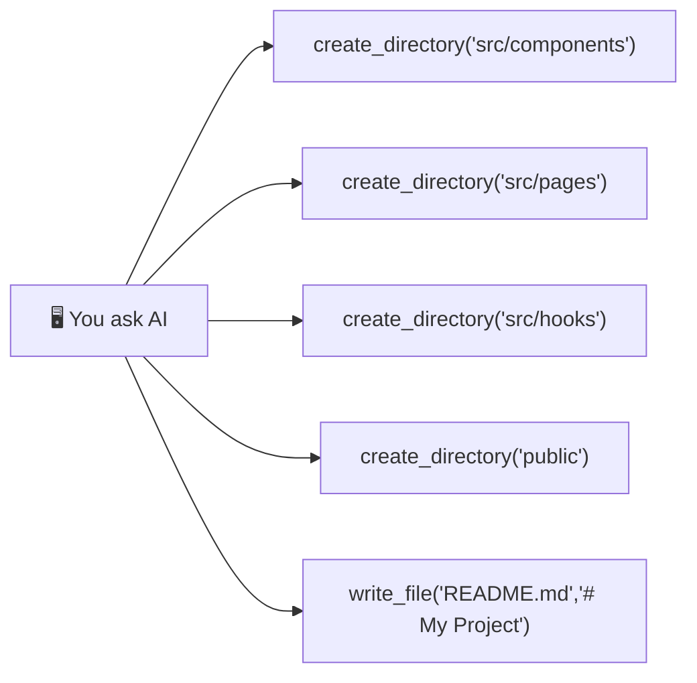

[🇷🇺 Русская версия](README-RU.md)

<br />

<div align="center">
  <h1>🖥️ @developkiko/desktop-commander</h1>
  <p><strong>MCP server for terminal operations and file editing</strong></p>
  <p>Fork of <a href="https://github.com/wonderwhy-er/DesktopCommanderMCP">Desktop Commander</a> with critical fixes for large file handling</p>

  <p>
    <a href="https://www.npmjs.com/package/@developkiko/desktop-commander">
      
    </a>
    <a href="https://github.com/developkiko/DsktpCmndr/blob/main/LICENSE">
      
    </a>
    <a href="https://github.com/developkiko/DsktpCmndr">
      
    </a>
    <br />
    <a href="https://nodejs.org/">
      
    </a>
    <a href="https://www.typescriptlang.org/">
      
    </a>
    
  </p>
</div>

---

## 📋 Table of Contents

- [What is this?](#-what-is-this)
- [✨ What's Fixed?](#-whats-fixed)
- [📦 Installation](#-installation)
- [⚙️ Configuration in Chatbox AI](#️-configuration-in-chatbox-ai)
- [🔧 Available Tools](#-available-tools)
- [💡 Usage Examples](#-usage-examples)
- [📚 Why This Fork?](#-why-this-fork)
- [🔗 Links](#-links)

---

## 🧐 What is this?

**Desktop Commander** is an MCP (Model Context Protocol) server that gives AI assistants like Claude, Chatbox, Cursor, and others direct access to your computer's **file system** and **terminal**.

With it, an LLM agent can:
- 📁 Create, read, edit, and delete files and folders
- 🔍 Search for files and text across your project
- 🖥️ Run terminal commands and Python scripts
- 📄 Work with PDFs, Excel files, and images
- ✏️ Perform surgical text replacements with `edit_block`

This is a **maintained fork** with critical bug fixes — see below.

---

## ✨ What's Fixed?

The original Desktop Commander had a critical issue: **no content size limits** in file operations. When an AI tried to write files larger than ~500 lines, the entire content was sent as a single MCP JSON-RPC message, causing:

> ❌ `Unterminated string in JSON at position 37769`

### 🔴 Problem 1: write_file buffer overflow

**Before (original):** Writing 5000 lines → 1 giant JSON-RPC string → stdio buffer overflows → `JSON.parse` crash

**After (fixed):** Content is automatically split into 30-line chunks, each written in a separate MCP call:

| Chunk | Mode    | Content       |
|-------|---------|---------------|
| #1    | rewrite | Lines 1–30   |
| #2    | append  | Lines 31–60  |
| #3    | append  | Lines 61–90  |
| ...   | append  | ...           |
| #167  | append  | Lines 4971–5000 |

### 🔴 Problem 2: No size validation for read/write

**Before:** `writeFile()` could receive 500MB+ in one call → OOM. `readFile()` could load a 2GB file → heap overflow.

**After:** Explicit byte limits with clear error messages:
- `writeFile()`: **10 MB max** content size
- `readFileInternal()`: **50 MB max** file size
- `handleWriteFile()`: **10,000 lines hard cap** with auto-chunking up to that limit

### 🔴 Problem 3: Windows path handling

Paths are now properly normalized regardless of slash direction (`/` vs `\`).

---

## 📦 Installation

### Option A: Via npx (recommended)

```bash
npx @developkiko/desktop-commander@latest
```

### Option B: Global install

```bash
npm install -g @developkiko/desktop-commander
desktop-commander
```

### Option C: Local development

```bash
# Clone and build
git clone https://github.com/developkiko/DsktpCmndr.git
cd DsktpCmndr
npm install
npm run build

# Run directly
node dist/index.js
```

---

## ⚙️ Configuration in Chatbox AI

To use this server in [Chatbox AI](https://chatboxai.app/):

1. Open **Settings → MCP Servers**
2. Click **Add MCP Server** (or edit existing)
3. Fill in:

| Field     | Value                                      |
|-----------|--------------------------------------------|
| Name      | `DsktpCmndr`                               |
| Type      | `stdio`                                    |
| Command   | `npx`                                      |
| Args      | `@developkiko/desktop-commander@latest`    |
| Env       | *(leave empty unless needed)*              |

4. **Save and restart** Chatbox

> **Or, for the local build:**
> - Command: `node`
> - Args: `E:\LLM\mcps\DsktpCmndr\dist\index.js`

---

## 🔧 Available Tools

| # | Tool | Description |
|---|------|-------------|
| 1 | `read_file` | Read files (text, PDF, Excel, images) with `offset`/`length` pagination |
| 2 | `read_multiple_files` | Read multiple files at once |
| 3 | `write_file` | **Auto-chunking!** Writes files with automatic splitting for large content |
| 4 | `edit_block` | Surgical find-and-replace in files |
| 5 | `create_directory` | Create folders (recursive) |
| 6 | `list_directory` | List folder contents with configurable depth |
| 7 | `move_file` | Move or rename files |
| 8 | `get_file_info` | Get file metadata (size, dates, line count, sheets) |
| 9 | `write_pdf` | Create and modify PDF files |
| 10 | `start_process` | Run terminal commands and REPLs (Python, Node.js, etc.) |
| 11 | `read_process_output` | Read process output with pagination |
| 12 | `interact_with_process` | Send input to a running process |
| 13 | `force_terminate` | Stop a running process |
| 14 | `kill_process` | Kill a process by PID |
| 15 | `start_search` | Search files by name or content (streaming) |
| 16 | `get_config` | View server configuration |
| 17 | `set_config_value` | Modify server configuration |

---

## 💡 Usage Examples

### 📁 Creating a project structure

> *"Create folders for a React project: `src/components`, `src/pages`, `src/hooks`, `public`, and a blank `README.md`"*



### 🔍 Searching for text in files

> *"Find all `.ts` files in `E:\WORK\my\GameDev` that contain `GameLoop` and show the first 10 lines"*

1. `start_search(path="E:\WORK\my\GameDev", pattern="GameLoop", searchType="content", filePattern="*.ts")`
2. `get_more_search_results(sessionId)`
3. For each result: `read_file(path, offset=0, length=10)`

### 📊 Analyzing a large CSV

> **Bad approach:** ❌ "Read this 500MB CSV file" → MCP buffer overflow

> **Good approach:** ✅ *"Read the first 5 lines of `sales.csv` to see headers, then start Python and analyze with pandas"*

```
1. read_file("sales.csv", offset=0, length=5)  → shows headers
2. start_process("python -i")
3. import pandas as pd
4. df = pd.read_csv("E:/DATA/sales.csv")       ← Python reads directly
5. df.groupby("Region")["Amount"].sum()         ← analysis in Python
```

### 🐍 Running a Python script

> *"Run `E:\scripts\backup.py` and tell me what it outputs"*

```
1. start_process("python E:\scripts\backup.py")
2. read_process_output(pid)
```

### ✏️ Replacing text across files

> *"Replace `console.log` with `logger.info` in all `.js` files in `E:\WORK\app`"*

```
1. start_search(path="E:\WORK\app", pattern="console.log", filePattern="*.js")
2. For each match: edit_block(file, old="console.log", new="logger.info")
```

---

## 📚 Why This Fork?

The original [Desktop Commander](https://github.com/wonderwhy-er/DesktopCommanderMCP) by wonderwhy-er is a fantastic project. This fork exists to:

1. **Fix the critical auto-chunking bug** — large files would crash the MCP transport
2. **Add proper size validation** — prevent OOM from accidental giant file reads/writes
3. **Provide ongoing maintenance** — as an independent community fork
4. **Ensure Windows compatibility** — proper path handling for Windows users

All credit for the original architecture goes to **wonderwhy-er** and contributors.

---

## 🔗 Links

| Resource | Link |
|----------|------|
| 📦 **npm** | [@developkiko/desktop-commander](https://www.npmjs.com/package/@developkiko/desktop-commander) |
| 🐙 **GitHub** | [github.com/developkiko/DsktpCmndr](https://github.com/developkiko/DsktpCmndr) |
| 🏠 **Original** | [Desktop Commander by wonderwhy-er](https://github.com/wonderwhy-er/DesktopCommanderMCP) |
| 💬 **MCP Protocol** | [modelcontextprotocol.io](https://modelcontextprotocol.io) |

---

<div align="center">
  <sub>Built with ❤️ by <strong>Kiko</strong> — MIT License</sub>
</div>
